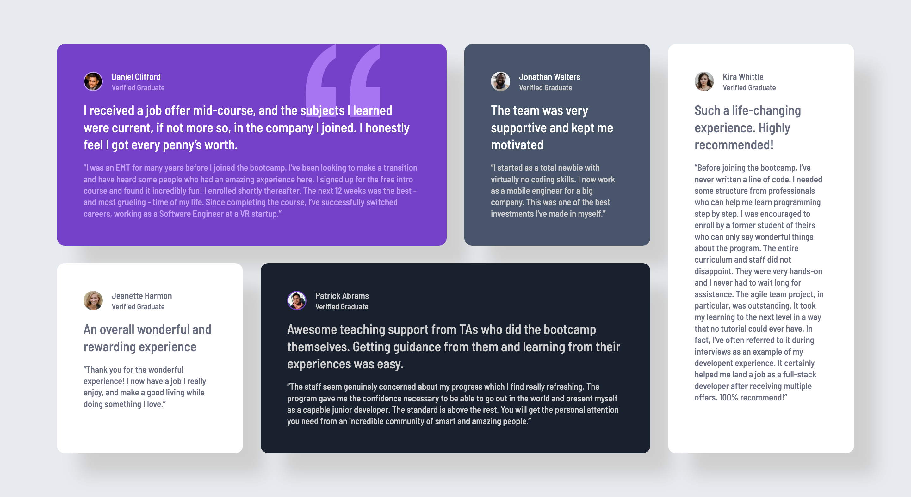

# Frontend Mentor - Testimonials grid section solution

This is a solution to the [Testimonials grid section challenge on Frontend Mentor](https://www.frontendmentor.io/challenges/testimonials-grid-section-Nnw6J7Un7). Frontend Mentor challenges help you improve your coding skills by building realistic projects. 

## Table of contents

- [Overview](#overview)
  - [The challenge](#the-challenge)
  - [Screenshot](#screenshot)
  - [Links](#links)
- [My process](#my-process)
  - [Built with](#built-with)
  - [What I learned](#what-i-learned)
  - [Continued development](#continued-development)
  - [Useful resources](#useful-resources)

## Overview

### The challenge

Users should be able to:

- View the optimal layout for the site depending on their device's screen size

### Screenshot

### Links

- Solution URL: [https://github.com/dpencsi/frontendmentor-testimonials-grid-section](https://github.com/dpencsi/frontendmentor-testimonials-grid-section)
- Live Site URL: [https://dpencsi.github.io/frontendmentor-testimonials-grid-section/](https://dpencsi.github.io/frontendmentor-testimonials-grid-section/)

## My process

### Built with

- Semantic HTML5 markup
- CSS custom properties
- Flexbox
- CSS Grid
- Mobile-first workflow

### What I learned

I learnet about using `grid-template-areas`. Plus I learnt about `position` and `z-index` and how you can put something behing elements with `z-index: -1` except if you don't put a `position: relative` and `z-index: 1` on the parent div what I used on the div with the "daniel" class the element (the icon image) will be behind the parent div and thats not good.

### Useful resources

- [PX to REM Converter](https://nekocalc.com/px-to-rem-converter) - Well until I am not used to use REM this website is perfect.
- [Grid template areas](https://css-tricks.com/almanac/properties/g/grid/grid-template-areas/) - This is a nice blog about `grid-template-areas`.
- [Offset parent and stacking context: positioning elements in all three dimensions](https://polypane.app/blog/offset-parent-and-stacking-context-positioning-elements-in-all-three-dimensions/) - This blog will tell you what happens when you use the `z-index: -1` on an element what you don't want to be behind your parent div.
